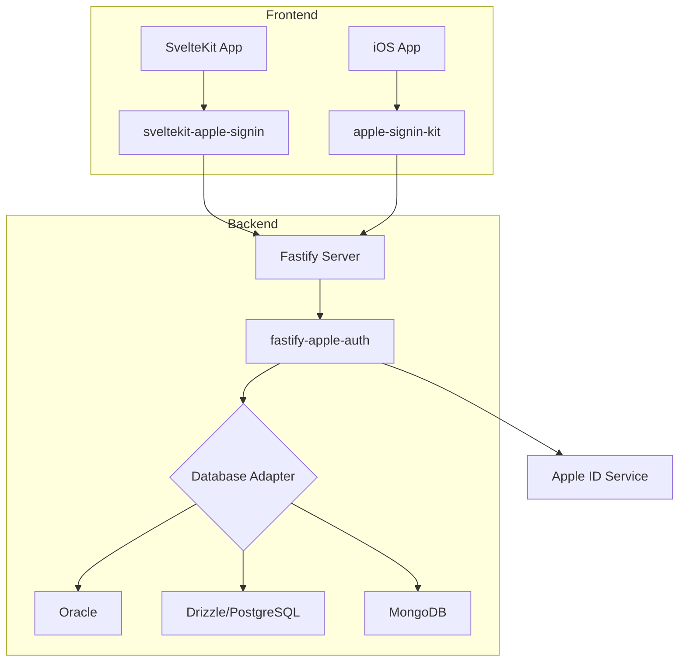

# Apple Sign-In SDK

[](https://opensource.org/licenses/Apache-2.0)
[](https://www.typescriptlang.org/)
[](https://swift.org/)

**Production-grade Apple Sign-In ecosystem** for modern web and mobile applications.

## Overview

This monorepo provides a complete Apple Sign-In solution across multiple platforms:

| Package | Platform | Description |
|---------|----------|-------------|
| [`@acedergren/fastify-apple-auth`](packages/fastify-apple-auth.md) | Node.js | Core Fastify backend with PKCE, sessions, account lockout |
| [`@acedergren/fastify-apple-signin-oracle`](packages/adapters/oracle.md) | Node.js | Oracle Database adapter |
| [`@acedergren/fastify-apple-signin-drizzle`](packages/adapters/drizzle.md) | Node.js | Drizzle ORM adapter (PostgreSQL, MySQL, SQLite) |
| [`@acedergren/fastify-apple-signin-mongodb`](packages/adapters/mongodb.md) | Node.js | MongoDB adapter |
| [`@acedergren/sveltekit-apple-signin`](packages/sveltekit-apple-signin.md) | Web | SvelteKit frontend integration |
| [`apple-signin-kit`](packages/apple-signin-kit.md) | iOS | Swift Package for native iOS apps |

## Key Features

### Security-First Design

- **PKCE (RFC 7636)** - Proof Key for Code Exchange with SHA-256 code challenge
- **Account Lockout** - NIST 800-63B compliant progressive lockout (5 attempts, 15min base)
- **Session Management** - Token rotation, device binding, concurrent session limits
- **Timing-Attack Prevention** - Constant-time comparison for all security-critical operations

### Production-Ready

- **331+ Unit Tests** - Comprehensive test coverage across all packages
- **Battle-Tested** - Extracted from production SaaS application (Running Days)
- **Type-Safe** - Full TypeScript support with strict mode
- **Database Agnostic** - Pluggable adapter architecture

### Developer Experience

- **Minimal Configuration** - Sensible defaults with full customization
- **Modern Stack** - Svelte 5, Fastify 5, Swift 6
- **Excellent Docs** - Complete API reference and integration guides

## Quick Start

=== "Fastify Backend"

    ```bash
    pnpm add @acedergren/fastify-apple-auth @acedergren/fastify-apple-signin-drizzle
    ```

    ```typescript
    import fastify from 'fastify';
    import { appleAuthPlugin } from '@acedergren/fastify-apple-auth';
    import { drizzleAdapter } from '@acedergren/fastify-apple-signin-drizzle';

    const app = fastify();

    await app.register(appleAuthPlugin, {
      apple: {
        clientId: process.env.APPLE_CLIENT_ID,
        teamId: process.env.APPLE_TEAM_ID,
        keyId: process.env.APPLE_KEY_ID,
        privateKey: process.env.APPLE_PRIVATE_KEY,
      },
      adapter: drizzleAdapter({ db: drizzleDb }),
    });
    ```

=== "SvelteKit Frontend"

    ```bash
    pnpm add @acedergren/sveltekit-apple-signin
    ```

    ```svelte
    <script>
      import { AppleSignInButton } from '@acedergren/sveltekit-apple-signin';
    </script>

    <AppleSignInButton
      variant="black"
      size="large"
      on:success={handleSuccess}
    />
    ```

=== "iOS Native"

    ```swift
    // Package.swift
    dependencies: [
      .package(url: "https://github.com/acedergren/apple-signin-sdk", from: "1.0.0")
    ]
    ```

    ```swift
    import AppleSignInKit

    let service = AppleSignInService()
    let credential = try await service.signIn()
    ```

## Architecture



## License

Apache 2.0 - See [LICENSE](https://github.com/acedergren/apple-signin-sdk/blob/main/LICENSE) for details.
