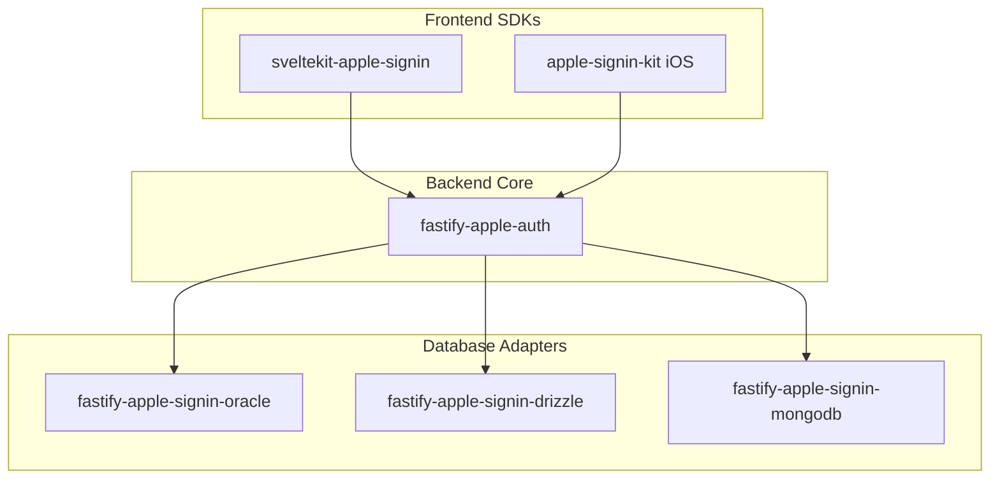

# Package Overview

The Apple Sign-In SDK is organized as a monorepo with specialized packages for each platform and database.

## Architecture



## Package Matrix

| Package | npm | Platform | Database |
|---------|-----|----------|----------|
| `@acedergren/fastify-apple-auth` | [](https://www.npmjs.com/package/@acedergren/fastify-apple-auth) | Node.js | - |
| `@acedergren/fastify-apple-signin-oracle` | [](https://www.npmjs.com/package/@acedergren/fastify-apple-signin-oracle) | Node.js | Oracle |
| `@acedergren/fastify-apple-signin-drizzle` | [](https://www.npmjs.com/package/@acedergren/fastify-apple-signin-drizzle) | Node.js | PostgreSQL, MySQL, SQLite |
| `@acedergren/fastify-apple-signin-mongodb` | [](https://www.npmjs.com/package/@acedergren/fastify-apple-signin-mongodb) | Node.js | MongoDB |
| `@acedergren/sveltekit-apple-signin` | [](https://www.npmjs.com/package/@acedergren/sveltekit-apple-signin) | Web | - |
| `apple-signin-kit` | SPM | iOS 17+ | - |

## Choosing a Database Adapter

### Oracle

Best for:

- Enterprise environments with existing Oracle infrastructure
- Oracle Cloud Infrastructure (OCI) deployments
- High-throughput transactional workloads

```bash
pnpm add @acedergren/fastify-apple-signin-oracle
```

[Oracle Adapter Documentation →](adapters/oracle.md)

### Drizzle ORM

Best for:

- Projects using PostgreSQL, MySQL, or SQLite
- Teams wanting type-safe SQL queries
- Serverless deployments (SQLite, PlanetScale, Neon)

```bash
pnpm add @acedergren/fastify-apple-signin-drizzle
```

[Drizzle Adapter Documentation →](adapters/drizzle.md)

### MongoDB

Best for:

- Document-oriented data models
- Flexible schema requirements
- MongoDB Atlas deployments

```bash
pnpm add @acedergren/fastify-apple-signin-mongodb
```

[MongoDB Adapter Documentation →](adapters/mongodb.md)

## Dependency Graph

```
@acedergren/fastify-apple-auth (core)
├── jose (JWT handling)
├── @fastify/cookie (session cookies)
└── @fastify/rate-limit (optional)

@acedergren/fastify-apple-signin-oracle
├── @acedergren/fastify-apple-auth (peer)
└── oracledb (peer)

@acedergren/fastify-apple-signin-drizzle
├── @acedergren/fastify-apple-auth (peer)
└── drizzle-orm (peer)

@acedergren/fastify-apple-signin-mongodb
├── @acedergren/fastify-apple-auth (peer)
└── mongodb (peer)

@acedergren/sveltekit-apple-signin
├── svelte (peer)
└── @sveltejs/kit (peer)

apple-signin-kit (Swift)
└── AuthenticationServices (system)
```

## Version Compatibility

All packages follow semantic versioning and are released together.

| SDK Version | Fastify | SvelteKit | iOS | Node.js |
|-------------|---------|-----------|-----|---------|
| 1.x | 5.x | 2.x | 17+ | 20+ |
