# Account Lockout

Progressive account lockout following NIST 800-63B guidelines to prevent brute-force attacks.

## Overview

After repeated failed authentication attempts, accounts are temporarily locked with progressively longer durations.

```mermaid
graph LR
    A[Attempt 1] --> B[Attempt 2]
    B --> C[Attempt 3]
    C --> D[Attempt 4]
    D --> E[Attempt 5]
    E --> F[🔒 Locked 15min]
    F --> G[Attempt 6]
    G --> H[🔒 Locked 30min]
    H --> I[...]
    I --> J[🔒 Max 24h]
```



## Configuration

```typescript
await app.register(appleAuthPlugin, {
  lockout: {
    enabled: true,              // Enable lockout (default: true)
    maxAttempts: 5,             // Attempts before first lockout
    baseDurationMinutes: 15,    // First lockout duration
    maxDurationMinutes: 1440,   // Max lockout (24 hours)
    multiplier: 2,              // Duration multiplier
  },
});
```

## Lockout Formula

```
lockoutDuration = min(baseDuration * (multiplier ^ lockoutCount), maxDuration)
```

With default settings:

| Lockout # | Duration | Cumulative |
|-----------|----------|------------|
| 1st | 15 min | 15 min |
| 2nd | 30 min | 45 min |
| 3rd | 1 hour | 1h 45min |
| 4th | 2 hours | 3h 45min |
| 5th | 4 hours | 7h 45min |
| 6th+ | 24 hours (max) | - |

## NIST 800-63B Compliance

The SDK implements NIST Digital Identity Guidelines:

| Requirement | Implementation |
|-------------|----------------|
| Rate limiting | ✅ Progressive lockout |
| No permanent lockout | ✅ Max 24 hours |
| Secure notification | ✅ Optional email alerts |
| Administrative unlock | ✅ Via adapter |
| Audit logging | ✅ All attempts logged |

## How It Works

### Failed Attempt Recording

```typescript
// On authentication failure
await adapter.recordFailedAttempt(userId, {
  timestamp: new Date(),
  ipAddress: request.ip,
  userAgent: request.headers['user-agent'],
  reason: 'invalid_token',
});
```

### Lockout Check

```typescript
// Before allowing authentication
const lockout = await adapter.getLockoutStatus(userId);

if (lockout?.isLocked) {
  const retryAfter = lockout.lockedUntil.getTime() - Date.now();
  throw new AppleAuthError('ACCOUNT_LOCKED', {
    retryAfter: Math.ceil(retryAfter / 1000),
    lockedUntil: lockout.lockedUntil,
  });
}
```

### Successful Authentication

```typescript
// On successful auth, clear lockout
await adapter.clearLockout(userId);
```

## Database Schema

### Lockout Table

```sql
CREATE TABLE auth_lockouts (
  user_id VARCHAR(36) PRIMARY KEY,
  failed_attempts INTEGER DEFAULT 0,
  lockout_count INTEGER DEFAULT 0,
  locked_until TIMESTAMP,
  last_failed_at TIMESTAMP,
  first_failed_at TIMESTAMP,
  FOREIGN KEY (user_id) REFERENCES auth_users(id)
);
```

### Audit Table (Optional)

```sql
CREATE TABLE auth_lockout_events (
  id VARCHAR(36) PRIMARY KEY,
  user_id VARCHAR(36) NOT NULL,
  event_type VARCHAR(20) NOT NULL, -- 'attempt', 'locked', 'unlocked'
  ip_address VARCHAR(45),
  user_agent VARCHAR(512),
  reason VARCHAR(100),
  created_at TIMESTAMP DEFAULT CURRENT_TIMESTAMP
);
```

## API Responses

### During Lockout

```json
{
  "error": "ACCOUNT_LOCKED",
  "message": "Account temporarily locked due to too many failed attempts",
  "retryAfter": 900,
  "lockedUntil": "2025-01-15T10:30:00Z"
}
```

HTTP Status: `423 Locked`

Headers:

```
Retry-After: 900
```

### Near Lockout Warning

```json
{
  "error": "AUTH_FAILED",
  "message": "Invalid credentials",
  "attemptsRemaining": 2,
  "warning": "Account will be locked after 2 more failed attempts"
}
```

## Security Considerations

### Timing Attacks

Lockout checks use constant-time comparison to prevent username enumeration:

```typescript
// Always perform full validation to prevent timing attacks
const user = await adapter.findUserByAppleId(appleId);
const lockout = await adapter.getLockoutStatus(user?.id);

// Simulate work even if user doesn't exist
if (!user) {
  await delay(50 + Math.random() * 50);
  throw new AppleAuthError('AUTH_FAILED');
}
```

### Distributed Lockout

For distributed systems, use database-level locking:

```typescript
// PostgreSQL example with row-level locking
await db.query(`
  UPDATE auth_lockouts
  SET failed_attempts = failed_attempts + 1,
      last_failed_at = NOW()
  WHERE user_id = $1
`, [userId]);
```

### IP-Based Limiting

In addition to user lockout, consider IP-based rate limiting:

```typescript
await app.register(rateLimit, {
  max: 100,
  timeWindow: '15 minutes',
  keyGenerator: (request) => request.ip,
});
```

## Administrative Functions

### Manual Unlock

```typescript
// Adapter method
async function unlockAccount(userId: string): Promise<void> {
  await db.query(`
    UPDATE auth_lockouts
    SET failed_attempts = 0,
        lockout_count = 0,
        locked_until = NULL
    WHERE user_id = $1
  `, [userId]);
}
```

### Unlock All

```typescript
// Emergency unlock all accounts
await db.query(`
  UPDATE auth_lockouts
  SET locked_until = NULL
  WHERE locked_until > NOW()
`);
```

## Monitoring

### Metrics

```typescript
// Prometheus metrics
const lockoutCounter = new Counter({
  name: 'auth_lockouts_total',
  help: 'Total account lockouts',
  labelNames: ['reason'],
});

const failedAttempts = new Counter({
  name: 'auth_failed_attempts_total',
  help: 'Total failed authentication attempts',
});
```

### Alerts

Recommended alerts:

- High lockout rate (>10/minute)
- Same IP triggering multiple lockouts
- Admin accounts locked
- Unusual lockout patterns (potential attack)

## Testing

```typescript
describe('Account Lockout', () => {
  it('locks account after max attempts', async () => {
    for (let i = 0; i < 5; i++) {
      await attemptAuth(userId, 'wrong-token');
    }

    const response = await attemptAuth(userId, 'wrong-token');
    expect(response.status).toBe(423);
    expect(response.body.retryAfter).toBe(900);
  });

  it('clears lockout on successful auth', async () => {
    await triggerLockout(userId);
    await wait(15 * 60 * 1000); // Wait for lockout to expire

    const response = await attemptAuth(userId, 'valid-token');
    expect(response.status).toBe(200);

    const lockout = await adapter.getLockoutStatus(userId);
    expect(lockout.failedAttempts).toBe(0);
  });
});
```
