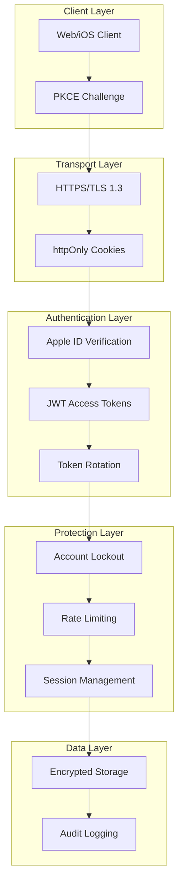

# Security Overview

The Apple Sign-In SDK implements defense-in-depth security with multiple protection layers.

## Security Architecture



## Compliance

### Standards Implemented

| Standard | Coverage | Details |
|----------|----------|---------|
| **RFC 7636 (PKCE)** | ✅ Full | SHA-256 code challenge |
| **NIST 800-63B** | ✅ Full | Account lockout, session management |
| **OWASP API Top 10** | ✅ 9/10 | See compliance matrix below |

### OWASP API Security 2023

| Risk | Status | Implementation |
|------|--------|----------------|
| API1: BOLA | ✅ | User context filtering in all queries |
| API2: Broken Auth | ✅ | Apple Sign-In PKCE, lockout, sessions |
| API3: Property Auth | ✅ | Explicit response schemas |
| API4: Resource Consumption | ✅ | Rate limiting on all endpoints |
| API5: BFLA | ✅ | Role-based access control |
| API6: Mass Assignment | ✅ | Strict input validation |
| API7: SSRF | ✅ | URL validation, allow-lists |
| API8: Security Misconfig | ✅ | Secure defaults, CSP headers |
| API9: Improper Inventory | ✅ | OpenAPI documentation |
| API10: Unsafe Consumption | ✅ | Apple API validation |

## Key Security Features

### 1. PKCE (Proof Key for Code Exchange)

Prevents authorization code interception attacks.

[Learn more about PKCE →](pkce.md)

### 2. Account Lockout

Progressive lockout following NIST 800-63B guidelines.

[Learn more about Account Lockout →](account-lockout.md)

### 3. Session Management

Secure session handling with token rotation and device binding.

[Learn more about Sessions →](sessions.md)

## Security Defaults

All security features are **enabled by default**:

```typescript
// These are the defaults - no configuration needed
await app.register(appleAuthPlugin, {
  apple: { /* required */ },
  jwt: {
    secret: process.env.JWT_SECRET,
    accessTokenTtl: '15m',      // Short-lived
    refreshTokenTtl: '7d',      // Weekly rotation
  },
  lockout: {
    enabled: true,
    maxAttempts: 5,
    baseDurationMinutes: 15,
  },
  session: {
    maxConcurrentSessions: 5,
    userAgentBinding: true,
    rotateRefreshToken: true,
  },
  cookies: {
    secure: true,               // HTTPS only
    httpOnly: true,             // No JS access
    sameSite: 'lax',            // CSRF protection
  },
});
```

## Timing Attack Prevention

All security-critical comparisons use constant-time algorithms:

```typescript
import { timingSafeEqual } from 'crypto';

// ✅ Safe - constant time
function safeCompare(a: string, b: string): boolean {
  const bufA = Buffer.from(a);
  const bufB = Buffer.from(b);
  if (bufA.length !== bufB.length) return false;
  return timingSafeEqual(bufA, bufB);
}

// ❌ Unsafe - variable time (DO NOT USE)
function unsafeCompare(a: string, b: string): boolean {
  return a === b; // Leaks information via timing
}
```

Used for:

- State parameter validation
- PKCE verifier comparison
- Token hash comparison
- CSRF token validation

## Token Security

### Access Tokens

- **Lifetime:** 15 minutes (configurable)
- **Storage:** httpOnly cookie (web), Keychain (iOS)
- **Algorithm:** HS256 (symmetric) or ES256 (asymmetric)

### Refresh Tokens

- **Lifetime:** 7 days (configurable)
- **Rotation:** New token on each use
- **Storage:** Database (hashed), httpOnly cookie (client)
- **Revocation:** Immediate on logout or theft detection

### Token Theft Detection

```typescript
// If refresh token is used after rotation, all sessions are revoked
if (token.rotatedAt && token.usedAt > token.rotatedAt) {
  await adapter.deleteUserSessions(token.userId);
  throw new AppleAuthError('TOKEN_THEFT_DETECTED');
}
```

## Cookie Security

```typescript
// Default cookie settings
{
  httpOnly: true,       // Prevents XSS token theft
  secure: true,         // HTTPS only
  sameSite: 'lax',      // Blocks CSRF in most cases
  path: '/',
  maxAge: 604800,       // 7 days
  domain: undefined,    // Current host only
}
```

### SameSite Explained

| Value | CSRF Protection | Cross-Site Use |
|-------|-----------------|----------------|
| `strict` | ✅ Full | ❌ Breaks OAuth redirects |
| `lax` | ✅ Good | ✅ Allows OAuth |
| `none` | ❌ None | ✅ Full (requires Secure) |

We default to `lax` because `strict` breaks the OAuth redirect flow.

## Rate Limiting

| Endpoint | Limit | Window |
|----------|-------|--------|
| `/auth/apple` (init) | 20 | 1 minute |
| `/auth/apple/callback` | 5 | 1 minute |
| `/auth/refresh` | 20 | 1 minute |
| `/auth/logout` | 10 | 1 minute |

## Security Headers

Recommended headers (configure via Helmet or manually):

```typescript
{
  'Strict-Transport-Security': 'max-age=31536000; includeSubDomains',
  'X-Content-Type-Options': 'nosniff',
  'X-Frame-Options': 'DENY',
  'X-XSS-Protection': '1; mode=block',
  'Content-Security-Policy': "default-src 'self'",
  'Referrer-Policy': 'strict-origin-when-cross-origin',
}
```

## Reporting Security Issues

If you discover a security vulnerability:

1. **Do NOT** open a public issue
2. Email: security@yourapp.com
3. Include:
   - Description of vulnerability
   - Steps to reproduce
   - Potential impact
4. We will respond within 48 hours

## Security Checklist

Before going to production:

- [ ] JWT secret is 32+ characters
- [ ] Cookies set to `secure: true`
- [ ] HTTPS enforced everywhere
- [ ] Rate limiting configured
- [ ] Account lockout enabled
- [ ] Session limits set
- [ ] Security headers configured
- [ ] Apple credentials in secrets manager
- [ ] Audit logging enabled
- [ ] Error messages don't leak info
