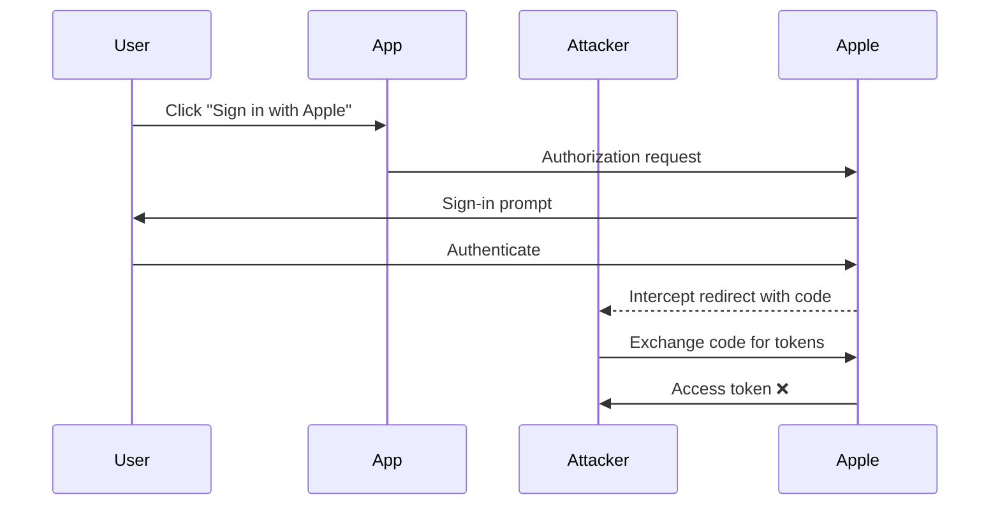
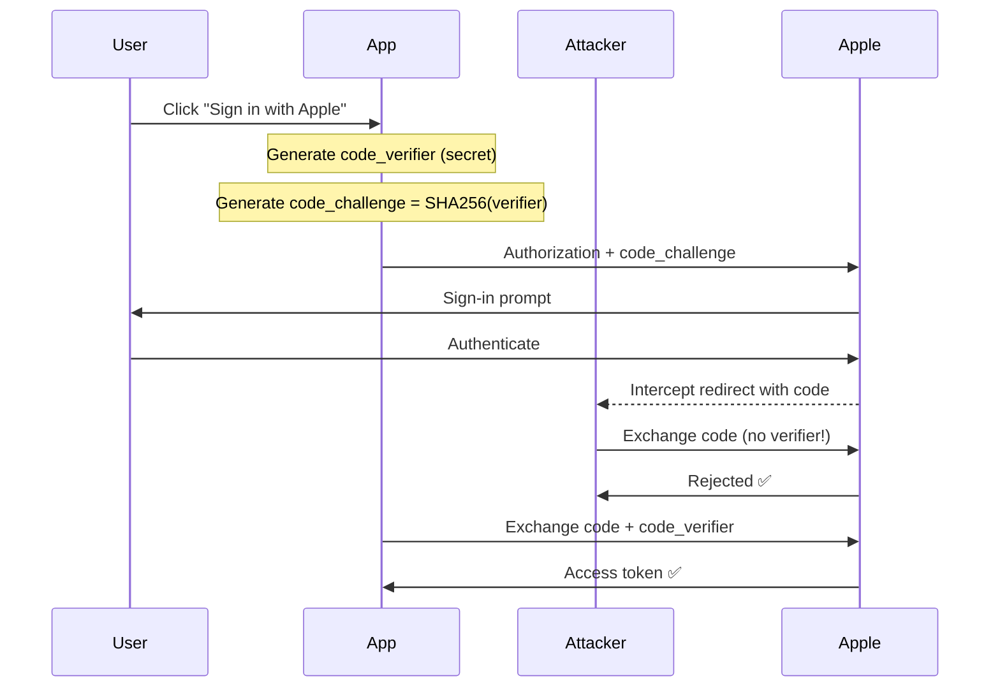

# PKCE (Proof Key for Code Exchange)

PKCE (RFC 7636) prevents authorization code interception attacks, especially critical for mobile and SPA clients.

## The Problem

Without PKCE, an attacker who intercepts the authorization code can exchange it for tokens:



## PKCE Solution

PKCE binds the authorization request to the token exchange:



## Implementation

### Code Verifier

A cryptographically random string (43-128 characters):

```typescript
import { randomBytes } from 'crypto';

function generateCodeVerifier(): string {
  // 32 bytes = 256 bits of entropy
  const buffer = randomBytes(32);
  // URL-safe base64 encoding
  return buffer
    .toString('base64')
    .replace(/\+/g, '-')
    .replace(/\//g, '_')
    .replace(/=/g, '');
}
```

### Code Challenge

SHA-256 hash of the verifier:

```typescript
import { createHash } from 'crypto';

function generateCodeChallenge(verifier: string): string {
  const hash = createHash('sha256').update(verifier).digest();
  return hash
    .toString('base64')
    .replace(/\+/g, '-')
    .replace(/\//g, '_')
    .replace(/=/g, '');
}
```

### Authorization Request

```typescript
const verifier = generateCodeVerifier();
const challenge = generateCodeChallenge(verifier);

// Store verifier in session (server-side)
session.pkceVerifier = verifier;

// Build authorization URL
const authUrl = new URL('https://appleid.apple.com/auth/authorize');
authUrl.searchParams.set('client_id', config.clientId);
authUrl.searchParams.set('redirect_uri', config.redirectUri);
authUrl.searchParams.set('response_type', 'code');
authUrl.searchParams.set('scope', 'email name');
authUrl.searchParams.set('code_challenge', challenge);
authUrl.searchParams.set('code_challenge_method', 'S256');
```

### Token Exchange

```typescript
// Retrieve verifier from session
const verifier = session.pkceVerifier;

// Exchange code for tokens
const response = await fetch('https://appleid.apple.com/auth/token', {
  method: 'POST',
  headers: { 'Content-Type': 'application/x-www-form-urlencoded' },
  body: new URLSearchParams({
    client_id: config.clientId,
    client_secret: generateClientSecret(),
    code: authorizationCode,
    grant_type: 'authorization_code',
    redirect_uri: config.redirectUri,
    code_verifier: verifier, // Proves possession
  }),
});
```

## SDK Implementation

The SDK handles PKCE automatically:

```typescript
// Plugin generates and manages PKCE internally
await app.register(appleAuthPlugin, {
  apple: {
    clientId: '...',
    // PKCE is always enabled, no configuration needed
  },
});
```

### Verifier Storage

The verifier must be stored securely between authorization and token exchange:

| Platform | Storage | Security |
|----------|---------|----------|
| Web (Server) | Server session | Tied to session cookie |
| Web (SPA) | httpOnly cookie | Not accessible to JS |
| iOS | Memory | Lives during auth flow |

### iOS Implementation

```swift
import CryptoKit

func generateCodeVerifier() -> String {
    var bytes = [UInt8](repeating: 0, count: 32)
    _ = SecRandomCopyBytes(kSecRandomDefault, bytes.count, &bytes)
    return Data(bytes).base64EncodedString()
        .replacingOccurrences(of: "+", with: "-")
        .replacingOccurrences(of: "/", with: "_")
        .replacingOccurrences(of: "=", with: "")
}

func generateCodeChallenge(from verifier: String) -> String {
    let data = Data(verifier.utf8)
    let hash = SHA256.hash(data: data)
    return Data(hash).base64EncodedString()
        .replacingOccurrences(of: "+", with: "-")
        .replacingOccurrences(of: "/", with: "_")
        .replacingOccurrences(of: "=", with: "")
}
```

## Security Considerations

### Verifier Entropy

- **Minimum:** 43 characters (256 bits after base64)
- **Recommended:** 43-128 characters
- **Our implementation:** 43 characters (32 bytes → 256 bits)

### Challenge Method

Always use `S256` (SHA-256), never `plain`:

| Method | Security | Use Case |
|--------|----------|----------|
| `S256` | ✅ Secure | Always use |
| `plain` | ❌ Insecure | Legacy only |

### Timing Attacks

Verifier comparison must be constant-time:

```typescript
// ❌ Bad - variable time
if (receivedVerifier !== storedVerifier) {
  throw new Error('Invalid verifier');
}

// ✅ Good - constant time
import { timingSafeEqual } from 'crypto';

const expected = Buffer.from(storedVerifier);
const received = Buffer.from(receivedVerifier);

if (!timingSafeEqual(expected, received)) {
  throw new Error('Invalid verifier');
}
```

## Troubleshooting

### "Invalid grant" Error

**Causes:**

1. Verifier doesn't match challenge
2. Code expired (5 minute TTL)
3. Code already used

**Debug:**

```typescript
// Log challenge at authorization
console.log('Challenge:', generateCodeChallenge(verifier));

// Log at token exchange
console.log('Verifier:', verifier);
console.log('Expected challenge:', generateCodeChallenge(verifier));
```

### Session Lost Between Requests

**Causes:**

1. Cookie not set (check SameSite policy)
2. Different domain between auth and callback
3. Session expired

**Solution:**

Ensure callback URL domain matches authorization request domain.

## References

- [RFC 7636 - PKCE](https://datatracker.ietf.org/doc/html/rfc7636)
- [Apple Sign In Documentation](https://developer.apple.com/documentation/sign_in_with_apple)
- [OAuth 2.0 Security Best Practices](https://datatracker.ietf.org/doc/html/draft-ietf-oauth-security-topics)
