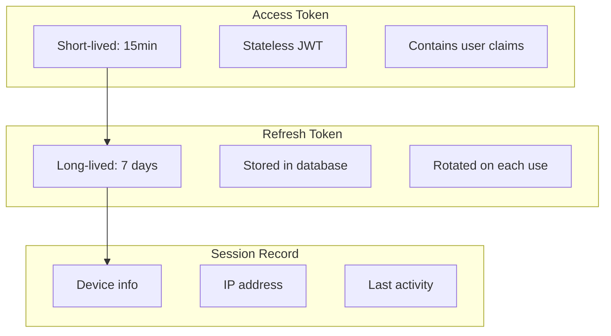
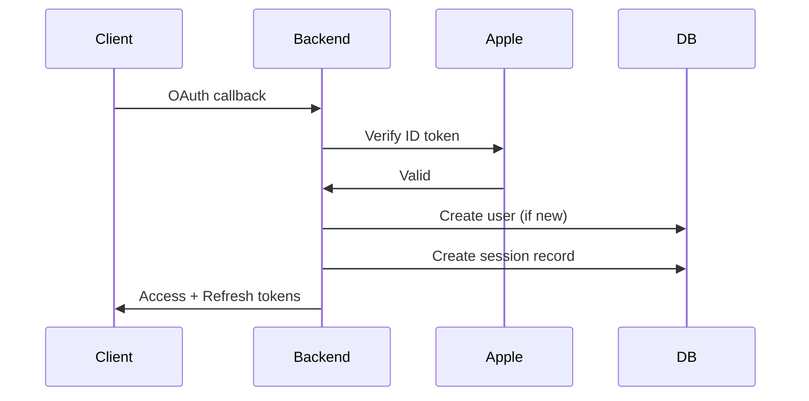
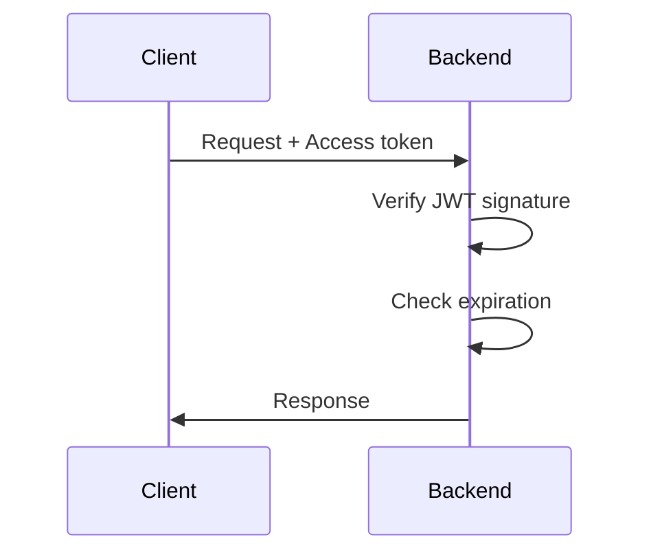
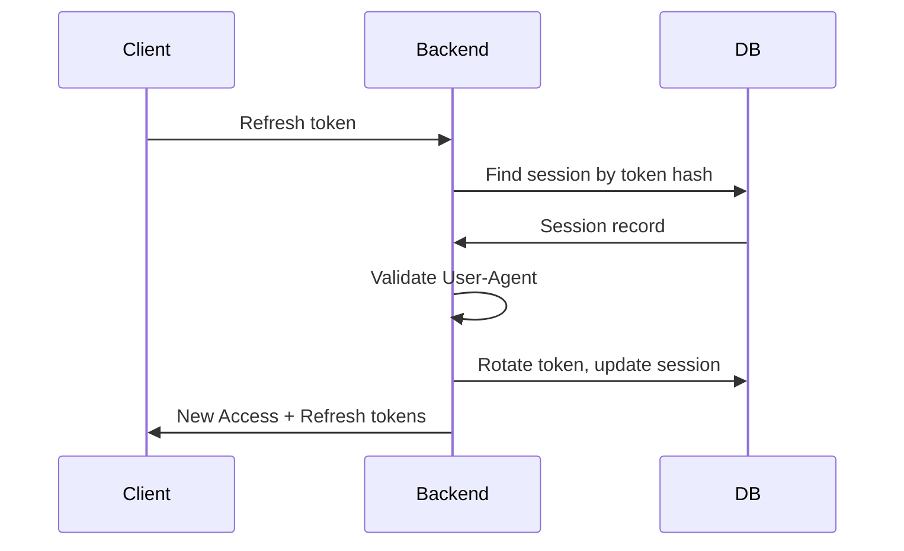
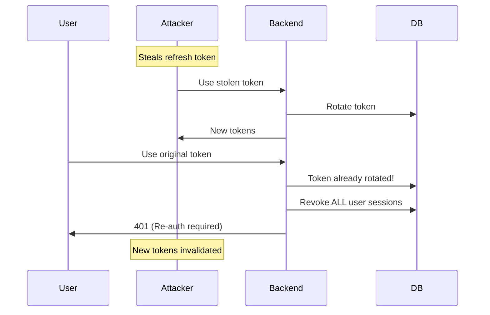

# Session Management

Secure session handling with token rotation, device binding, and concurrent session limits.

## Overview

The SDK implements a dual-token architecture:



## Configuration

```typescript
await app.register(appleAuthPlugin, {
  jwt: {
    secret: process.env.JWT_SECRET,
    accessTokenTtl: '15m',      // Short-lived
    refreshTokenTtl: '7d',      // Long-lived
  },
  session: {
    maxConcurrentSessions: 5,   // Per user limit
    userAgentBinding: true,     // Bind to device
    rotateRefreshToken: true,   // Rotate on each refresh
    revokeOnPasswordChange: true,
  },
});
```

## Token Lifecycle

### 1. Initial Authentication



### 2. Using Access Token



### 3. Refreshing Tokens



## Token Rotation

Every refresh generates a new refresh token:

```typescript
async function refreshTokens(refreshToken: string, request: Request) {
  const tokenHash = hashToken(refreshToken);
  const session = await adapter.findSessionByToken(tokenHash);

  if (!session) {
    throw new AppleAuthError('INVALID_TOKEN');
  }

  // Check if token was already rotated (potential theft)
  if (session.rotatedAt) {
    // Token reuse detected - revoke all sessions
    await adapter.deleteUserSessions(session.userId);
    throw new AppleAuthError('TOKEN_THEFT_DETECTED');
  }

  // Generate new tokens
  const newRefreshToken = generateToken();
  const newAccessToken = generateAccessToken(session.user);

  // Rotate in database
  await adapter.updateSession(session.id, {
    tokenHash: hashToken(newRefreshToken),
    rotatedAt: new Date(),
    lastUsedAt: new Date(),
  });

  return { accessToken: newAccessToken, refreshToken: newRefreshToken };
}
```

### Theft Detection

If an attacker steals a refresh token:

1. **Attacker uses stolen token** → Gets new tokens
2. **Legitimate user uses old token** → Reuse detected
3. **All sessions revoked** → Attacker loses access



## Device Binding

Sessions are bound to User-Agent:

```typescript
// On session creation
const session = await adapter.createSession({
  userId: user.id,
  tokenHash: hashToken(refreshToken),
  userAgent: request.headers['user-agent'],
  ipAddress: request.ip,
});

// On refresh
if (session.userAgent !== request.headers['user-agent']) {
  // Different device - potential token theft
  await adapter.deleteSession(session.id);
  throw new AppleAuthError('DEVICE_MISMATCH');
}
```

### User-Agent Sanitization

```typescript
function sanitizeUserAgent(ua: string | null): string | null {
  if (!ua) return null;
  // Limit length to prevent storage attacks
  return ua.slice(0, 512).replace(/[\x00-\x1F\x7F-\x9F]/g, '');
}
```

## Concurrent Session Limits

Prevent unlimited active sessions:

```typescript
// Before creating new session
const activeCount = await adapter.countUserSessions(userId);

if (activeCount >= config.maxConcurrentSessions) {
  // Option 1: Reject new session
  throw new AppleAuthError('MAX_SESSIONS_REACHED');

  // Option 2: Revoke oldest session (our default)
  const oldest = await adapter.getOldestSession(userId);
  await adapter.deleteSession(oldest.id);
}
```

### Session Management UI

```typescript
// GET /api/auth/sessions
app.get('/sessions', async (request, reply) => {
  const sessions = await adapter.getUserSessions(request.user.id);

  return sessions.map(s => ({
    id: s.id,
    device: parseUserAgent(s.userAgent),
    location: geolocate(s.ipAddress),
    lastActive: s.lastUsedAt,
    current: s.id === request.sessionId,
  }));
});

// DELETE /api/auth/sessions/:id
app.delete('/sessions/:id', async (request, reply) => {
  const session = await adapter.findSessionById(request.params.id);

  if (session?.userId !== request.user.id) {
    return reply.forbidden();
  }

  await adapter.deleteSession(session.id);
  return { success: true };
});
```

## Token Storage

### Web (httpOnly Cookies)

```typescript
// Set cookies on authentication
reply
  .setCookie('access_token', accessToken, {
    httpOnly: true,
    secure: true,
    sameSite: 'lax',
    path: '/',
    maxAge: 15 * 60, // 15 minutes
  })
  .setCookie('refresh_token', refreshToken, {
    httpOnly: true,
    secure: true,
    sameSite: 'lax',
    path: '/api/auth/refresh', // Only sent to refresh endpoint
    maxAge: 7 * 24 * 60 * 60, // 7 days
  });
```

### iOS (Keychain)

```swift
let keychain = KeychainManager(service: "com.app.auth")

// Store with secure accessibility
try keychain.store(
  token: refreshToken,
  for: .refreshToken,
  accessibility: .afterFirstUnlockThisDeviceOnly
)
```

## Session Revocation

### Single Session

```typescript
// User-initiated logout
await adapter.deleteSession(sessionId);
```

### All Sessions

```typescript
// Security event (password change, suspicious activity)
await adapter.deleteUserSessions(userId);
```

### Specific Device

```typescript
// Revoke by User-Agent pattern
await adapter.deleteSessionsByUserAgent(userId, 'iPhone');
```

## Database Schema

```sql
CREATE TABLE auth_sessions (
  id VARCHAR(36) PRIMARY KEY,
  user_id VARCHAR(36) NOT NULL,
  token_hash VARCHAR(64) NOT NULL,
  user_agent VARCHAR(512),
  ip_address VARCHAR(45),
  created_at TIMESTAMP DEFAULT CURRENT_TIMESTAMP,
  expires_at TIMESTAMP NOT NULL,
  last_used_at TIMESTAMP DEFAULT CURRENT_TIMESTAMP,
  rotated_at TIMESTAMP, -- For theft detection

  FOREIGN KEY (user_id) REFERENCES auth_users(id) ON DELETE CASCADE
);

CREATE INDEX idx_sessions_user ON auth_sessions(user_id);
CREATE INDEX idx_sessions_token ON auth_sessions(token_hash);
CREATE INDEX idx_sessions_expires ON auth_sessions(expires_at);
```

## Cleanup

Expired sessions should be periodically cleaned:

```sql
-- Run via cron or scheduled job
DELETE FROM auth_sessions WHERE expires_at < NOW();
```

Or use database TTL (MongoDB):

```javascript
db.auth_sessions.createIndex(
  { expiresAt: 1 },
  { expireAfterSeconds: 0 }
);
```
